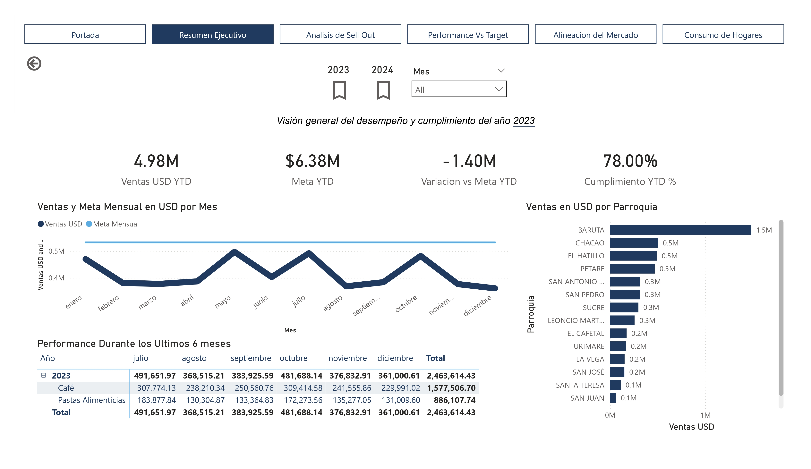
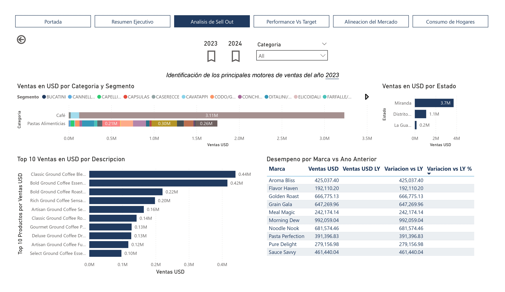
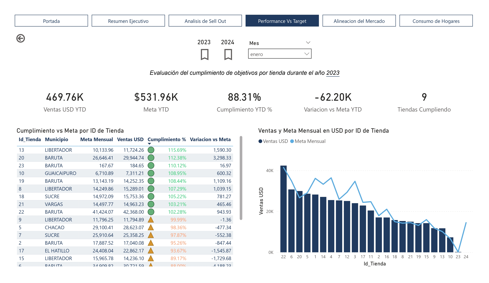
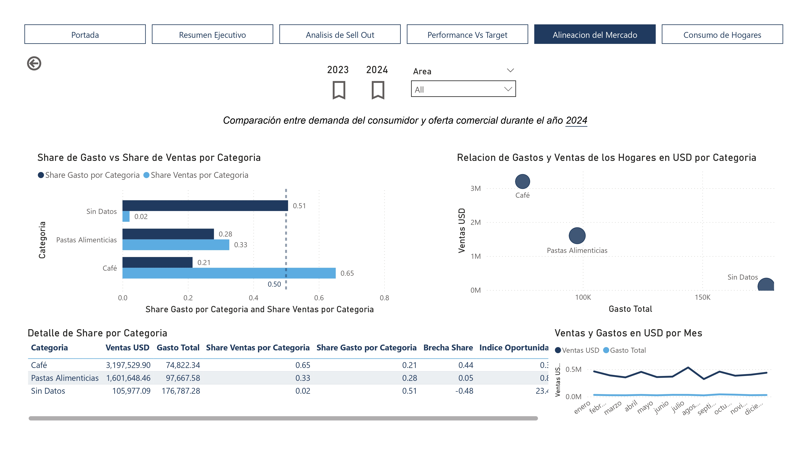

# Análisis Integrado de Sell Out y Consumo de Hogares 📊

## 👤 Descripción del Proyecto
Este proyecto fue desarrollado como un **Ejercicio Práctico de Analista de Business Intelligence**. El objetivo principal es integrar datos de ventas finales (Sell Out) con datos de comportamiento de consumo en hogares para identificar brechas de mercado, evaluar el cumplimiento de metas comerciales y optimizar la toma de decisiones estratégicas.

---

## 🛠️ Tecnologías Utilizadas
* **Herramienta:** Microsoft Power BI.
* **Lenguaje:** DAX (Data Analysis Expressions) para medidas estratégicas.
* **ETL:** Power Query para la limpieza, transformación y despivotado de metas.
* **Modelado:** Esquema en estrella (Star Schema).

---

## 🏗️ Arquitectura y Modelado de Datos
El modelo se diseñó bajo un esquema en estrella para garantizar el rendimiento y la claridad, integrando cinco fuentes principales:

* **Tablas de Hechos:** Sell Out (ventas por tienda/producto), Consumo de Hogares y Objetivos Comerciales.
* **Tablas de Dimensiones:** Productos (con jerarquías completas), Tiendas (geografía) y una tabla de Calendario estandarizada.

> **Nota Técnica:** Se resolvió la desconexión física de los objetivos anuales mediante el despivotado de columnas y lógica DAX, permitiendo análisis de cumplimiento mensual y acumulado (YTD) sin comprometer la integridad del modelo.

---

## 📈 Estructura del Informe
El reporte está diseñado para guiar al usuario desde una visión general hasta el detalle transaccional:

### 1. Resumen Ejecutivo
Visión de alto nivel con KPIs de Ventas USD, evolución mensual frente a la meta y distribución territorial.

### 2. Análisis de Sell Out
Identificación de los motores del negocio: productos líderes (Top 10), desempeño de marcas y crecimiento por categorías.

### 3. Desempeño vs. Objetivos
Evaluación operativa por tienda para identificar brechas de cumplimiento y priorizar acciones comerciales.

### 4. Alineación del Mercado (Núcleo Estratégico)
Comparativa entre el **Share de Ventas vs. Share de Gasto** del consumidor. Esta sección permite detectar dónde la demanda del mercado supera la oferta de la empresa (Índice de Oportunidad).

### 5. Exploración Avanzada (Drill-Through)
Páginas de detalle que permiten "navegar" desde un gráfico agregado hasta el nivel de SKU o transacción mensual, asegurando la trazabilidad total de los datos.

---

## 🧠 Desafíos Técnicos Superados
* **Calidad de Datos:** Se realizó una auditoría y reconstrucción de la dimensión de productos para corregir la falta de códigos de barras presentes en las fuentes de ventas.
* **Inteligencia de Tiempo:** Implementación de medidas robustas para cálculos YTD, MTD y comparativas interanuales (YoY).
* **Optimización de Metas:** Transformación de una estructura de objetivos no analítica (en columnas) a una base de datos relacional eficiente.

---

## 📂 Contenido del Repositorio
* `Informe Analítico BI.pdf`: Documentación técnica detallada del desarrollo.
* `Ejercicio Práctico.pdf`: Requerimientos originales de la prueba.
* `SellOutConsumoHogaresOptimized.pbix`: Archivo de Power BI (incluye modelo y visualizaciones).
